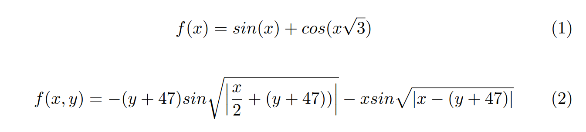
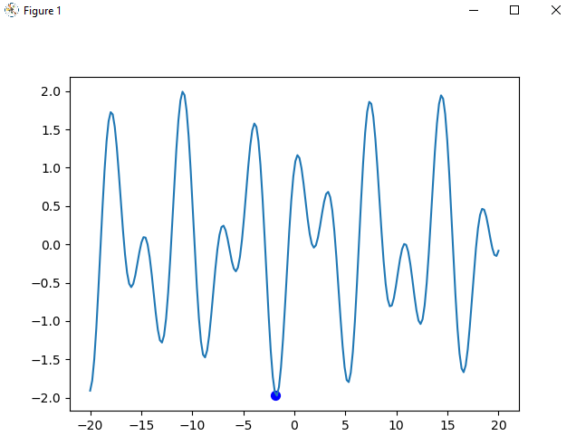

# Algoritmo-Genetico
Implementação de um algoritmo genético em Python para encontrar o mínimo global em duas funções fitness distintas.

## O que é um algoritmo genético?

Um algoritmo genético é uma forma de busca heurística que imita o processo de seleção natural. Através dele são geradas soluções para problemas de otimização utilizando técnicas inspiradas por características evolucionárias, como seleção, mutação e crossover.

Algoritmos genéticos  atuam com a população com o objetivo de aumentar o resultado da função fitness. Essa função fitness representa o desempenho de um indivíduo de acordo com o ambiente atual. Cada um dos indivíduos de uma população possui um conjunto de características, que podem sofrer mutação ou podem ser alteradas. Essas propriedades são chamadas de genes. O conjunto de genes é conhecido como genoma.

A evolução é um processo iterativo, em que cada população é conhecida como geração. Uma evolução ocorre a partir de uma população de indivíduos que foram gerados aleatoriamente. Após esse passo, os indivíduos mais aptos são selecionados em um processo chamado de seleção.

Para criar uma nova geração, o algoritmo genético normalmente atua através de duas operações genéticas, que são o crossover e a mutação. Para criar um filho, os dois pais mais aptos são selecionados. O filho recebe alguns genes do primeiro pai e outros dos segundo pai. Esse processo é chamado de crossover. Normalmente os genes são representados por bits em um computador.

## Funções fitness a serem resolvidas

A imagem abaixo mostra as funções fitness a serem tratadas pelo algoritmo genético

## Resultados parciais

A figura abaixo apresenta o primeiro resultado parcial obtido. O algoritmo ainda não possui nenhuma característica de crossover implementada.

## Licença

MIT License

Copyright (c) 2020 Vitor Vidal

Permission is hereby granted, free of charge, to any person obtaining a copy
of this software and associated documentation files (the "Software"), to deal
in the Software without restriction, including without limitation the rights
to use, copy, modify, merge, publish, distribute, sublicense, and/or sell
copies of the Software, and to permit persons to whom the Software is
furnished to do so, subject to the following conditions:

The above copyright notice and this permission notice shall be included in all
copies or substantial portions of the Software.

THE SOFTWARE IS PROVIDED "AS IS", WITHOUT WARRANTY OF ANY KIND, EXPRESS OR
IMPLIED, INCLUDING BUT NOT LIMITED TO THE WARRANTIES OF MERCHANTABILITY,
FITNESS FOR A PARTICULAR PURPOSE AND NONINFRINGEMENT. IN NO EVENT SHALL THE
AUTHORS OR COPYRIGHT HOLDERS BE LIABLE FOR ANY CLAIM, DAMAGES OR OTHER
LIABILITY, WHETHER IN AN ACTION OF CONTRACT, TORT OR OTHERWISE, ARISING FROM,
OUT OF OR IN CONNECTION WITH THE SOFTWARE OR THE USE OR OTHER DEALINGS IN THE
SOFTWARE.
